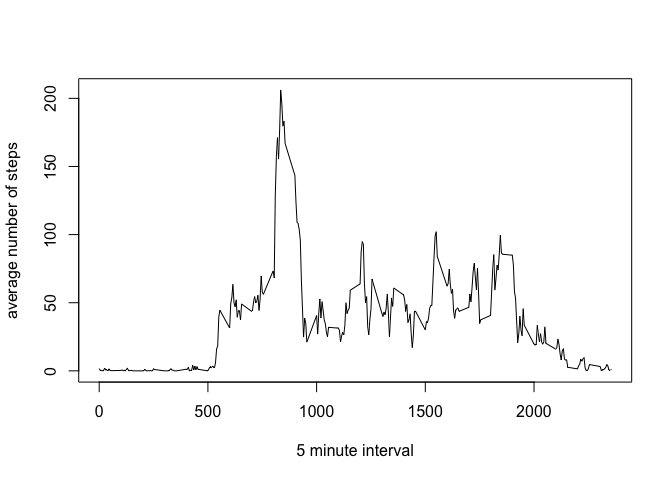

# Reproducible Research: Peer Assessment 1


## Loading and preprocessing the data
Reading the data into a data frame and convert the date to POSIXlt format and add a column with the corresponding weekday.

```r
activity_data <- read.csv("activity.csv")
activity_data$date<- as.POSIXct(activity_data$date)
#activity_data$date<- as.factor(activity_data$date)
activity_data$weekday <- weekdays(activity_data$date)
activity_data$weekday <-as.factor(activity_data$weekday)
```
## What is mean total number of steps taken per day?


```r
activity_day <-as.data.frame(with(activity_data, tapply(steps, list(as.factor(activity_data$date)),sum, na.rm=TRUE)))
colnames(activity_day) <-"steps"
activity_day[,"date"]<-as.POSIXct(rownames(activity_day))
activity_day$steps <-as.numeric(activity_day$steps)
options(scipen = 999)
mean_day <- round(mean(activity_day$steps, na.rm=TRUE), digits = 0)
median_day <- round(median(activity_day$steps, na.rm=TRUE),  digits = 1)
```

The mean number of steps per day is 9354, and the median number of steps is 10395.

### Histogram of total steps taken per day: 


```r
 library(ggplot2)
ggplot(activity_day, aes( steps, na.rm = TRUE)) + geom_histogram(binwidth=250)  
```

<!-- -->


## What is the average daily activity pattern?


```r
activity_mean <-as.data.frame(with(activity_data, tapply(steps, list(as.factor(activity_data$interval) ),mean, na.rm=TRUE)))
colnames(activity_mean) <-"mean_steps"
activity_mean[,"interval"]<-rownames(activity_mean)
activity_mean$mean_steps <-as.numeric(activity_mean$mean_steps)

int_max <-activity_mean[which.max(activity_mean$mean_steps), ][2]
plot(activity_mean$interval, activity_mean$mean_steps, type="l", xlab="5 minute interval", ylab="average number of steps")
```

<!-- -->

The most active interval on average is 835.


## Imputing missing values


```r
n_missing_values <- sum(is.na(activity_data$steps))
```

The number of missing values is 2304.


The code below identifies intervals with missing numbers of steps and replaces them with the average value for this interval at the same weekday.


```r
library(data.table)
activity_wd <-as.data.frame(with(activity_data, tapply(steps, list(as.factor(activity_data$interval),weekday),mean, na.rm=TRUE)))
activity_wd[,"interval"]<-rownames(activity_wd)
activity_data1 <-data.table(activity_data)

for (i in 1:length(activity_data1$steps)) {
    if (is.na(activity_data1$steps[i])) {
       activity_data1[i, "steps"] <- as.integer(activity_wd[as.character(activity_data1$interval[i]), 
                                             as.character(activity_data1$weekday[i])])
    }
}
# Code to calculate daily mean and median with interpolated data:

activity_day1 <-as.data.frame(with(activity_data1, tapply(steps, list(as.factor(activity_data1$date)),sum, na.rm=TRUE)))
colnames(activity_day1) <-"steps"
activity_day1[,"date"]<-as.POSIXct(rownames(activity_day1))
activity_day1$steps <-as.numeric(activity_day1$steps)
options(scipen = 999)
mean_day1 <- round(mean(activity_day1$steps, na.rm=TRUE), digits = 0)
median_day1 <- round(median(activity_day1$steps, na.rm=TRUE),  digits = 1)
```

The mean number of steps per day before and after interpolating are 9354 and 10810, and the median number of steps before and after are 10395 and 11015, respectively.


```r
 library(ggplot2)
ggplot(activity_day1, aes( steps)) + geom_histogram(binwidth=250)  
```

<!-- -->


## Are there differences in activity patterns between weekdays and weekends?


```r
activity_data<- data.table(activity_data)
activity_data[grepl(pattern = "Monday|Tuesday|Wednesday|Thursday|Friday", x = activity_data$weekday), "weekday_weekend"] <- "weekday"
activity_data[grepl(pattern = "Saturday|Sunday", x = activity_data$weekday), "weekday_weekend"] <- "weekend"
activity_data[, weekday_weekend := as.factor(weekday_weekend)]

activity_mean_wt <- activity_data[, c(lapply(.SD, mean, na.rm = TRUE)), .SDcols = c("steps"), by = .(interval, `weekday_weekend`)] 

ggplot(activity_mean_wt, aes(interval, steps,color=weekday_weekend)) + geom_line() + facet_grid(weekday_weekend~.)
```

<!-- -->

